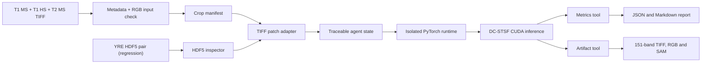
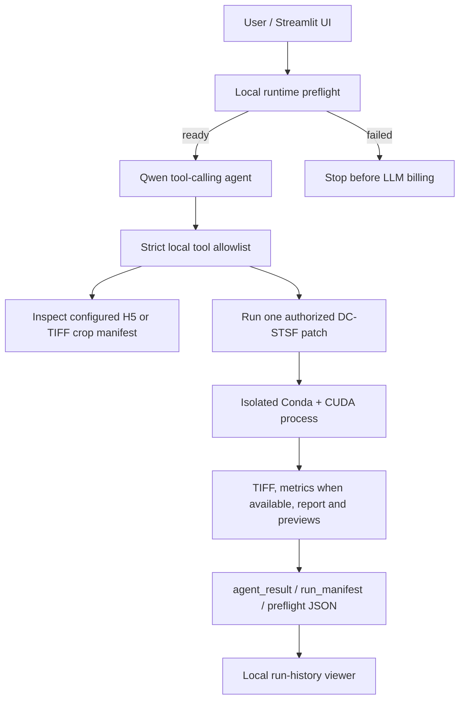

# RSFusionAgent

[](https://github.com/Mona659/RSFusionAgent/actions/workflows/ci.yml)

An executable, traceable agent for remote-sensing spatiotemporal-spectral fusion.

> **V1.0 scope:** YRE 151-band model with selectable, non-overlapping test patches.
> The primary route starts with raw TIFF input inspection and RGB previews, then a
> source-pixel crop authorized by a traceable manifest. Legacy HDF5 remains available
> as a regression-evaluation route. TIFF-to-HDF5 conversion, automatic registration and
> whole-scene stitching are reserved for later versions.
> TIFF reproduces the two `Database.py` contracts: simulation degrades inputs and keeps native
> `T2 HS` as reduced-resolution ground truth; real keeps full-resolution MS and interpolates HS.
> A real-mode `T2 HS` is only a pseudo-label, never a native high-resolution ground truth.

## What V1 does

RSFusionAgent V1 executes a reproducible tool workflow instead of asking a language
model to manipulate image arrays:



Every step is recorded in `run_manifest.json`. Large arrays are exchanged through
artifact paths rather than placed in agent state.

## Agent control-plane architecture



The control plane does not transfer HDF5 pixels, NumPy arrays or checkpoint contents to
the LLM. It is bounded by strict schemas, configured paths, one authorized patch index
and a maximum tool-loop length.

The architecture is inspired by the task-aware tool orchestration ideas in
[RS-Agent](https://github.com/IntelliSensing/RS-Agent), while this repository
implements an executable workflow for the author's YRE fusion model.

## Verified YRE demo

The V1 workflow was verified end to end on patch index 0 using the epoch-200
checkpoint. The private HDF5 data and checkpoint are not included in this repository.

| Fused RGB preview | Per-pixel SAM heatmap |
|---|---|
|  |  |

| PSNR (dB) | RMSE | SAM (degree) | ERGAS | SSIM | CC |
|---:|---:|---:|---:|---:|---:|
| 32.0344 | 0.02502 | 2.0984 | 1.8523 | 0.96577 | 0.97729 |

The two independent CUDA runs produced identical Agent outputs. Compared with the
historical TIFF exported by the legacy test script, the maximum absolute pixel
difference was `1.85e-4`, while all six reported metrics agreed at the displayed
precision.

## Frozen YRE-151 data contract

V1 reads the `test` dataset from two legacy HDF5 files. Each patch uses NHWC layout:

```text
[N, H, W, 306]
channels 0:4       -> MS
channels 4:155     -> interpolated auxiliary HS
channels 155:306   -> HS ground truth
```

The model receives:

```text
auxiliary MS : [1, 4,   H,   W] / 10000
auxiliary HS : [1, 151, H/3, W/3] / 10000
target MS    : [1, 4,   H,   W] / 10000
```

See [docs/data_contract.md](docs/data_contract.md) for the complete contract and
known legacy limitations.

## Current capabilities

- [x] Inspect standalone raster metadata
- [x] Validate a YRE-151 auxiliary/target HDF5 pair
- [x] Load and normalize one reduced-resolution test patch
- [x] Run the DC-STSF checkpoint in an isolated PyTorch environment
- [x] Calculate PSNR, RMSE, SAM, ERGAS, SSIM and CC
- [x] Save a 151-band prediction TIFF, prediction/reference RGB comparison and SAM heatmap
- [x] Save machine-readable metrics, tool trace and Markdown report
- [x] Check Conda, PyTorch, CUDA and checkpoint readiness before LLM billing
- [x] Inspect original MS/HS TIFF size, bands, spatial metadata and bounded RGB previews before cropping
- [x] Crop a raw TIFF triplet with a traceable YRE-legacy or custom source-pixel window
- [x] Run one crop-manifest authorized raw-TIFF patch and preserve target-MS georeferencing
- [x] Reproduce Database.py-style TIFF pseudo-reference metrics with an optional cropped T2 HS
- [ ] Convert TIFF triplet to the legacy HDF5 profile
- [ ] Validate pixel-level registration and geospatial alignment
- [ ] Perform overlapping whole-scene inference and weighted stitching
- [x] Add strict Qwen tool plans for H5 and crop-manifest TIFF inputs
- [x] Provide a local Streamlit H5/TIFF demo with previews and result downloads
- [x] Reload a prior local run without another LLM request
- [x] Retry only the known Windows native fast-fail once and record attempts
- [x] Run Ruff and pytest in GitHub Actions
- [ ] Add solution retrieval and experiment memory

## Project structure

```text
RSFusionAgent/
├── .github/workflows/
│   └── ci.yml
├── docs/
│   ├── assets/
│   │   ├── yre_rgb_preview.png
│   │   ├── yre_sam_heatmap.png
│   │   └── yre_metrics.json
│   ├── data_contract.md
│   ├── demo_script.md
│   └── v1_release.md
├── src/rsfusion_agent/
│   ├── agent/
│   │   ├── llm_client.py
│   │   ├── llm_state.py
│   │   ├── llm_tools.py
│   │   ├── llm_workflow.py
│   │   ├── state.py
│   │   ├── tiff_workflow.py
│   │   └── workflow.py
│   ├── models/
│   │   └── dc_stsf.py
│   ├── runtime/
│   │   ├── preflight_runner.py
│   │   └── yre151_runner.py
│   ├── tools/
│   │   ├── artifacts.py
│   │   ├── error_diagnosis.py
│   │   ├── h5_patch.py
│   │   ├── metrics.py
│   │   ├── model_runtime.py
│   │   ├── raster_inspector.py
│   │   ├── tiff_crop.py
│   │   ├── tiff_patch.py
│   │   └── tiff_triplet.py
│   ├── ui/
│   │   └── streamlit_app.py
│   └── cli.py
├── examples/
├── tests/
├── outputs/
└── pyproject.toml
```

## Installation

Create the lightweight agent environment:

```powershell
python -m venv .venv
.\.venv\Scripts\Activate.ps1
python -m pip install --upgrade pip
python -m pip install -e ".[dev]"
```

Install the optional natural-language control plane with:

```powershell
python -m pip install -e ".[dev,llm]"
```

The neural network runs in a separate existing Python environment containing a
compatible CUDA-enabled PyTorch installation. This avoids installing a second copy
of PyTorch into the agent environment.

Set the model runtime path for the current terminal session:

```powershell
$env:RSFUSION_MODEL_PYTHON = "C:\path\to\model-env\Scripts\python.exe"
```

Do not commit this machine-specific path. Set it in the terminal session or pass
`--model-python` explicitly. The V1 CLI does not automatically load `.env` files.

Before spending tokens on an agent request, check the model environment locally:

```powershell
rsfusion preflight-runtime `
  --checkpoint $checkpoint `
  --model-python $modelPython `
  --device cuda `
  --pretty
```

This verifies the isolated Python executable, PyTorch import, visible CUDA device and
checkpoint readability. It does not load HDF5 pixels or run a forward pass. A successful
`infer-h5` remains the full end-to-end model smoke test.

## Inspect the HDF5 inputs

```powershell
$auxH5 = "C:\path\to\YRE\DownT1YRE.h5"
$targetH5 = "C:\path\to\YRE\DownT2YRE.h5"

rsfusion inspect-h5 `
  --aux-h5 $auxH5 `
  --target-h5 $targetH5 `
  --patch-index 0 `
  --pretty
```

## Validate a future raw-TIFF input triplet

This is a metadata-only safety gate for the planned raw-data adapter. It expects
auxiliary MS (4 bands), auxiliary HS (151 bands at one-third width and height), and
target MS (4 bands). It checks CRS, bounds, grid compatibility, and the 3× resolution
relation; it never loads all pixels, reprojects, registers, crops, or runs inference.

```powershell
$auxMsTif = "C:\\path\\to\\T1_MS.tif"
$auxHsTif = "C:\\path\\to\\T1_HS.tif"
$targetMsTif = "C:\\path\\to\\T2_MS.tif"

rsfusion inspect-tiff-triplet `
  --aux-ms $auxMsTif `
  --aux-hs $auxHsTif `
  --target-ms $targetMsTif `
  --scale 3 `
  --pretty
```

Use `is_ready_for_preprocessing: true` as the prerequisite for the later TIFF-to-HDF5
adapter. Any `blocking_issues` must be fixed in the source data; this project does not
silently alter spatial data.

## Crop the raw TIFF triplet with the legacy YRE window

`Database.py` manually pairs source-pixel windows rather than registering TIFFs. The
default crop profile reproduces its active YRE test code exactly:

| Raster role | Source-pixel window |
|---|---|
| Auxiliary MS | `row=0, col=360, height=540, width=540` |
| Target MS | `row=0, col=360, height=540, width=540` |
| Auxiliary HS | `row=0, col=120, height=180, width=180` |

```powershell
rsfusion crop-tiff-triplet `
  --aux-ms $auxMsTif `
  --aux-hs $auxHsTif `
  --target-ms $targetMsTif `
  --output-dir "outputs\\yre_legacy_crop" `
  --pretty
```

The command writes three new cropped TIFFs and `crop_manifest.json`; it never changes
the source files. To choose another range, use an explicit profile. MS height/width must
be divisible by three; omitted HS offsets are derived from the MS offsets divided by three.

```powershell
rsfusion crop-tiff-triplet `
  --aux-ms $auxMsTif `
  --aux-hs $auxHsTif `
  --target-ms $targetMsTif `
  --output-dir "outputs\\custom_crop" `
  --profile custom `
  --ms-row-offset 0 `
  --ms-col-offset 360 `
  --window-height 540 `
  --window-width 540 `
  --hs-row-offset 0 `
  --hs-col-offset 120 `
  --pretty
```

The crop manifest records the correspondence assumption. It is not automatic
registration; it is the explicit source-pixel pairing you approved. Use that manifest
for raw YRE inference rather than passing the still-offset source TIFFs directly.

## Run one raw-TIFF experiment patch

The crop manifest locks the experiment type and source-pixel correspondence. `simulation`
applies Database.py's Gaussian blur and 3× down-sampling to inputs, retaining native target-HS
as ground truth. `real` retains a 540×540 MS test patch and interpolates HS to the common grid.

```powershell
$checkpoint = "C:\\path\\to\\checkpoints\\model-epochs200.pth"
$modelPython = "C:\\path\\to\\model-env\\Scripts\\python.exe"

rsfusion infer-tiff `
  --crop-manifest "outputs\\yre_legacy_crop\\crop_manifest.json" `
  --experiment-mode simulation `
  --patch-index 0 `
  --checkpoint $checkpoint `
  --model-python $modelPython `
  --patch-size 180 `
  --row-offset 0 `
  --col-offset 0 `
  --device cuda `
  --output-dir "outputs\\tiff_patch_0001" `
  --pretty
```

`patch-index` is the preferred row-major choice in the non-overlapping output grid, so changing
it does not crop again. For compatibility, `row-offset` and `col-offset` remain supported.
Simulation requires `T2 HS` and produces valid reduced-resolution metrics. Real mode can run
without `T2 HS`; a supplied `T2 HS` produces clearly labelled interpolated pseudo-label metrics.

## Run V1 inference

```powershell
$auxH5 = "C:\path\to\YRE\DownT1YRE.h5"
$targetH5 = "C:\path\to\YRE\DownT2YRE.h5"
$checkpoint = "C:\path\to\checkpoints\model-epochs200.pth"
$modelPython = "C:\path\to\model-env\Scripts\python.exe"

rsfusion infer-h5 `
  --aux-h5 $auxH5 `
  --target-h5 $targetH5 `
  --checkpoint $checkpoint `
  --model-python $modelPython `
  --patch-index 0 `
  --device cuda `
  --output-dir "outputs\yre_patch_0001" `
  --pretty
```

Generated artifacts:

```text
outputs/yre_patch_0001/
├── predicted_hs.tif
├── rgb_preview.png
├── reference_rgb_preview.png
├── sam_heatmap.png
├── metrics.json
├── report.md
├── run_manifest.json
└── intermediate/
    ├── model_input.npz
    └── model_output.npz
```

The H5 route intentionally reproduces the legacy TIFF convention: normalized `float32`
values, a synthetic transform and no CRS. In contrast, the crop-manifest TIFF route
preserves the target-MS crop CRS and transform.

## Run the natural-language agent (optional)

V0.2 implements the standard
[OpenAI Responses API function-calling loop](https://developers.openai.com/api/docs/guides/function-calling).
The LLM can select only three strict-schema tools per mode: inspect the configured HDF5
pair or crop manifest, run one configured patch, and read the latest result. Local paths,
crop windows and model settings cannot be supplied or changed by the model.

For the Qwen-compatible endpoint that you have already verified, set the generic
provider variables in the current terminal. Do not put a real key in source code,
`.env.example`, CLI arguments or Git history:

```powershell
$env:RSFUSION_LLM_PROVIDER = "qwen"
$env:RSFUSION_LLM_API_KEY = "your-api-key"
$env:RSFUSION_LLM_BASE_URL = "https://<workspace-id>.cn-beijing.maas.aliyuncs.com/compatible-mode/v1"
$env:RSFUSION_LLM_MODEL = "qwen3.7-flash"
```

The CLI also supports `openai`, `deepseek`, and `custom` OpenAI-compatible
providers. `DASHSCOPE_API_KEY`, `DEEPSEEK_API_KEY`, and `OPENAI_API_KEY` remain
available as provider-specific fallbacks. The CLI intentionally does not load `.env`
files automatically; this keeps secrets outside the repository.

Then reuse the local path variables from the inference example:

```powershell
rsfusion agent `
  --request "请先检查数据，再融合第 0 个 patch，并汇报指标和输出文件" `
  --provider qwen `
  --aux-h5 $auxH5 `
  --target-h5 $targetH5 `
  --checkpoint $checkpoint `
  --model-python $modelPython `
  --patch-index 0 `
  --device cuda `
  --output-dir "outputs\llm_yre_patch_0001" `
  --pretty
```

Only the user's text request plus sanitized file names, array shapes, scalar
statistics, metrics and warnings are sent to the API. HDF5 pixels, NumPy arrays and
checkpoint contents stay local. The complete design and safety boundaries are in
[docs/llm_agent.md](docs/llm_agent.md).

Each successful `agent` invocation also saves its full control-plane record to
`<output-dir>/agent_result.json`. It includes tool traces, provider/model metadata,
per-turn and aggregated token usage, and a best-effort cost estimate when the model
has a locally documented price rule. The estimate is for development observation only;
the provider billing console is authoritative.

By default, `agent` runs the same free local preflight before it constructs an LLM
client. The result is saved as `<output-dir>/preflight.json`; if preflight fails, no
model request is made. `--skip-preflight` is reserved for troubleshooting.

For a crop-manifest TIFF run, use the parallel `agent-tiff` entrypoint. It has the same
preflight, bounded tool loop, provider settings and local result record, but it reports
`metrics_status` instead of inventing reference metrics:

```powershell
rsfusion agent-tiff `
  --request "请检查裁剪清单，融合当前 TIFF patch，并汇报输出文件和指标可用性" `
  --provider qwen `
  --crop-manifest "outputs\yre_legacy_crop\crop_manifest.json" `
  --checkpoint $checkpoint `
  --model-python $modelPython `
  --patch-size 180 `
  --device cuda `
  --output-dir "outputs\llm_tiff_patch_0001" `
  --pretty
```

## Run the local visual demo

The local Streamlit interface defaults to the raw TIFF route. It first checks `T1 MS +
T1 HS + T2 MS` dimensions, bands, spatial metadata and RGB previews; it then uses the legacy
YRE or a custom source-pixel crop window, creates a local crop manifest, and invokes
`agent-tiff`. H5 is the second, regression-evaluation mode: it shows reference metrics and a
SAM heatmap. For **模拟实验（复现 Database.py）**, provide `ZY2.tif.tif`: it remains native
reduced-resolution ground truth while only inputs are degraded. For **真实实验**, `T2 HS` is
optional and shown only as a 3× interpolated pseudo-label. The UI reports the total patch count,
lets you select a patch, and shows that exact model-input patch before fusion outputs and metrics.

The UI retains the latest input-check, preflight, crop and fusion result for the current browser
session. These stage records are shown newest first, so running fusion does not hide the crop
preview. A successful crop manifest is reused only while its TIFF paths, experiment type, crop
window and run directory still match; fusion therefore does not execute the crop again.
Install the optional UI dependency once:

```powershell
python -m pip install -e ".[dev,llm,ui]"
```

Set the same `RSFUSION_LLM_*` variables used by the CLI, then start the page from the
project root:

```powershell
rsfusion-ui
```

The page opens locally in your browser. It never asks for or stores an API key; the
key remains in the terminal environment. It invokes the existing `rsfusion agent` or
`rsfusion agent-tiff` workflow, so the runtime preflight, tool allowlist, output isolation
and result JSON records remain active.

V0.4 adds a local run-history selector: reopen an existing `agent_result.json` from
the configured output root without calling the LLM again. The UI and CLI also default
to one extra retry only for the known Windows native fast-fail exit code `0xC0000409`.
Every retry is recorded in the runtime result as `attempt_count` and
`retried_exit_codes`. Set `--runtime-retries 0` to disable it, or at most `2` for
troubleshooting. Path, CUDA, H5 validation and timeout failures are never retried
blindly; the Agent receives a safe error category and recommended action instead.

For a concise local interview demonstration, follow [docs/demo_script.md](docs/demo_script.md).
The verified release boundary and deferred work are in [docs/v1_release.md](docs/v1_release.md).

## Tests

```powershell
python -m pytest -q
python -m ruff check --no-cache src tests examples
```

## Security

- Keep API keys and local runtime paths out of Git.
- Load only trusted PyTorch checkpoints. PyTorch checkpoints can contain serialized data.
- Output and intermediate model artifacts are ignored by Git.
- LLM tools use an allowlist, strict arguments, a configured patch index and a bounded loop.

## License and attribution

This project is planned to use the Apache-2.0 license. The DC-STSF architecture in
`models/dc_stsf.py` is adapted from the author's research project. Upstream license
and copyright notices must be preserved for any future third-party code reuse.
