# RSFusionAgent

[](https://github.com/Mona659/RSFusionAgent/actions/workflows/ci.yml)

面向遥感时空谱融合实验的本地优先 Agent：用受约束的 LLM Function Calling 编排输入检查、可追溯裁剪、独立模型环境预检、单 Patch 推理、质量评估、知识检索和运行记录。

> A local-first, traceable Agent for remote-sensing spatiotemporal-spectral fusion.

## 项目状态

- Python 包版本：`1.1.1`
- 当前开发阶段：V2.2
- Python：3.10+
- 当前模型契约：YRE DC_STSF，4 波段 MS、151 波段 HS、3 倍空间尺度
- 当前执行范围：H5/GeoTIFF 单 Patch 实验，不包含整景拼接或模型训练

RSFusionAgent 不是让大模型直接处理影像数组的聊天机器人。LLM 只负责理解请求并选择白名单工具；遥感数据、Checkpoint、PyTorch/CUDA 推理和生成制品都留在本机，由确定性的 Python 工作流执行。

## 为什么做这个项目

遥感融合实验通常跨越数据检查、空间裁剪、模型环境、GPU 推理、指标计算和结果解释。把这些步骤直接交给开放式 Agent 会带来路径泄漏、误调用昂贵推理、输入错配和结果不可追踪等风险。

本项目把 Agent 限制在可审计的控制面中：

- 工具集合由代码白名单决定，不提供任意 Shell、Python 或文件读取能力。
- 本地路径和运行配置由可信上下文注入，不由 LLM 自由填写。
- 融合必须由用户请求明确授权，并满足输入检查与清单等前置条件。
- TIFF 推理只能消费已经生成并检查过的 `crop_manifest.json`。
- 模型在单独配置的 PyTorch Python 子进程中运行，Agent/UI 环境不绑定 CUDA 依赖。
- 每次运行都可生成结构化结果、任务状态、脱敏 Trace 和人类可读报告。

## 已实现能力

| Area | Current implementation |
|---|---|
| Agent loop | 自定义、有限轮次、顺序 Function Calling；关闭并行工具调用 |
| Intent routing | 明确请求使用本地规则，模糊请求使用 Schema 约束的 LLM 回退 |
| Tool safety | Query/H5/TIFF 三类工具箱、严格参数、可信上下文、代码级前置条件 |
| H5 workflow | 检查 YRE151 H5、选择 Patch、独立进程推理、六项全参考指标与可视化 |
| TIFF workflow | 原始 TIFF 检查、RGB 预览、可追溯裁剪、真实/模拟实验和地理参考输出 |
| Model runtime | 独立 Python 子进程中的 PyTorch/CUDA 预检、严格权重加载和有限原生崩溃重试 |
| State and recovery | `task_state.json` 保存阶段与已完成工具；派生执行计划和恢复建议 |
| Local RAG | Markdown/JSON 离线词法检索、错误方案检索、历史实验摘要检索 |
| Evaluation | 版本化 RAG 来源命中评测；31 个公开 Agent 回放用例；模型结果提供 PSNR/RMSE/SAM/ERGAS/SSIM/CC |
| Observability | 工具状态、耗时、参数字段、Token、成本、制品名和脱敏错误 |
| Interfaces | CLI、Streamlit UI、可选 LangChain `StructuredTool` 适配 |
| Engineering | Pydantic v2、pytest、Ruff、GitHub Actions |

当前 LangChain 层只是同一工具箱的可选适配器，核心执行循环不依赖 LangGraph。当前 RAG 是本地词法检索，不是向量数据库或 Embedding 服务。

## 系统架构

```mermaid
flowchart LR
    U[User] --> UI[Streamlit or CLI]
    UI --> IR[Rules-first intent router]
    IR --> LOOP[Bounded function-calling loop]
    LOOP --> Q[Query toolbox]
    LOOP --> H[H5 toolbox]
    LOOP --> T[TIFF toolbox]
    Q --> RAG[Local lexical RAG and history]
    H --> HW[Deterministic H5 workflow]
    T --> TW[Manifest-driven TIFF workflow]
    H --> BRIDGE[Model runtime bridge]
    T --> BRIDGE
    BRIDGE --> PY[Separate PyTorch/CUDA process]
    PY --> MODEL[DC_STSF and trusted checkpoint]
    HW --> OUT[Local artifacts and metrics]
    TW --> OUT
    MODEL --> OUT
    LOOP --> OBS[State, trace and report]
```



核心文件：

- `src/rsfusion_agent/agent/llm_workflow.py`：有界 Function Calling 循环和显式推理授权。
- `src/rsfusion_agent/agent/llm_tools.py`：工具 Schema、白名单、可信上下文和前置条件。
- `src/rsfusion_agent/agent/intent_router.py`：规则优先、LLM 回退的意图识别。
- `src/rsfusion_agent/agent/workflow.py`：H5 单 Patch 确定性工作流。
- `src/rsfusion_agent/agent/tiff_workflow.py`：清单驱动的 TIFF 实验工作流。
- `src/rsfusion_agent/tools/model_runtime.py`：Agent 环境到模型环境的子进程桥接。
- `src/rsfusion_agent/rag/`：本地知识、错误、历史检索和 RAG 评测。
- `src/rsfusion_agent/ui/streamlit_app.py`：本地交互界面和运行历史展示。

更完整的实现说明见 [Project Context](docs/PROJECT_CONTEXT.md)、[Architecture](docs/ARCHITECTURE.md) 和 [Architecture Decisions](docs/DECISIONS.md)。

## 实验路径

### 原始 GeoTIFF 路径

```text
检查 T1 MS / T1 HS / T2 MS / 可选 T2 HS
    → 生成 RGB 预览
    → 选择源像素窗口
    → 写入 crop_manifest.json
    → 选择非重叠模型 Patch
    → 模型环境预检
    → 本地推理
    → GeoTIFF / 指标 / 预览 / Trace / 报告
```

- `simulation`：需要目标时相 HS，保留其原生低分辨率形式作为真值；仅对模型输入执行模糊和降采样。
- `real`：目标时相 HS 可选；提供时只作为 3 倍插值伪参考，不能解释为原生高分辨率真值。
- `external_registration`：接受用户对外部配准关系的明确声明，将部分元数据差异保留为警告；系统不会验证残余偏差，也不会自动配准或重投影。
- `strict_metadata`：要求 CRS、bounds 和 resolution 等元数据严格兼容。

### H5 回归评估路径

```text
检查辅助/目标 H5
    → 选择 test Patch
    → 展示实际模型输入和目标 HS
    → 模型环境预检
    → 本地推理
    → 六项全参考指标 / 预览 / Trace / 报告
```

冻结的数据布局为 NHWC `[N, H, W, 306]`：

```text
channels 0:4       -> MS
channels 4:155     -> interpolated HS
channels 155:306   -> HS reference
normalization      -> divide by 10000
```

H5 文件已经包含预生成 Patch，因此该路径不再执行一次空间裁剪。完整契约见 [Data Contract](docs/data_contract.md)。

## 安装

创建轻量 Agent 环境：

```powershell
python -m venv .venv
.\.venv\Scripts\Activate.ps1
python -m pip install --upgrade pip
python -m pip install -e ".[dev,llm,langchain,ui]"
```

基础依赖不包含 PyTorch。模型推理使用另一个已经安装兼容 PyTorch/CUDA 的 Python 环境：

```powershell
$env:RSFUSION_MODEL_PYTHON = "C:\path\to\model-env\python.exe"
```

API Key 只能通过环境变量配置，不接受 CLI Key 参数，也不会由 UI 保存：

```powershell
$env:RSFUSION_LLM_PROVIDER = "qwen"
$env:RSFUSION_LLM_API_KEY = "your-api-key"
$env:RSFUSION_LLM_BASE_URL = "https://<workspace-id>.cn-beijing.maas.aliyuncs.com/compatible-mode/v1"
$env:RSFUSION_LLM_MODEL = "qwen3.7-flash"
```

也支持 `openai`、`deepseek` 和自定义 OpenAI-compatible Responses API。仓库不会自动加载 `.env`；`.env.example` 只提供变量格式。

## 快速开始

### 1. 查看 CLI

```powershell
rsfusion -h
```

当前子命令包括：

```text
inspect-raster          inspect-tiff-triplet   crop-tiff-triplet
inspect-h5              preflight-runtime      infer-h5
infer-tiff              agent                  agent-query
agent-tiff              evaluate-rag          evaluate-agent
```

### 2. 先检查模型环境

```powershell
rsfusion preflight-runtime `
  --checkpoint $checkpoint `
  --model-python $modelPython `
  --device cuda `
  --pretty
```

预检验证 Python、PyTorch、CUDA 可见性和 Checkpoint 可读性，不读取 H5 像素，也不执行 forward pass。

### 3. 只读项目问答

不需要数据路径、Checkpoint 或 PyTorch 环境：

```powershell
rsfusion agent-query `
  --request "模拟实验的目标 HS 是什么？" `
  --knowledge-dir knowledge `
  --history-dir outputs/ui_runs `
  --output-dir outputs/query_demo `
  --provider qwen `
  --pretty
```

该入口只能访问任务状态、受控知识库、错误方案和历史实验摘要，不能裁剪影像或运行模型。

### 4. 原始 TIFF 实验

先检查输入：

```powershell
rsfusion inspect-tiff-triplet `
  --aux-ms $auxMsTif `
  --aux-hs $auxHsTif `
  --target-ms $targetMsTif `
  --alignment-mode external_registration `
  --pretty
```

再生成明确的裁剪清单：

```powershell
rsfusion crop-tiff-triplet `
  --aux-ms $auxMsTif `
  --aux-hs $auxHsTif `
  --target-ms $targetMsTif `
  --output-dir outputs/yre_crop `
  --experiment-mode real `
  --pretty
```

运行清单授权的 Agent：

```powershell
rsfusion agent-tiff `
  --request "检查裁剪清单，融合当前 TIFF patch，并汇报结果" `
  --crop-manifest outputs/yre_crop/crop_manifest.json `
  --checkpoint $checkpoint `
  --model-python $modelPython `
  --patch-size 540 `
  --patch-index 0 `
  --device cuda `
  --output-dir outputs/tiff_agent_run `
  --provider qwen `
  --pretty
```

模拟实验需在裁剪阶段提供 `--target-hs-reference`，并把 `--experiment-mode` 设为 `simulation`。

### 5. H5 实验

```powershell
rsfusion agent `
  --request "请先检查数据，再融合第 0 个 patch，并汇报指标" `
  --aux-h5 $auxH5 `
  --target-h5 $targetH5 `
  --checkpoint $checkpoint `
  --model-python $modelPython `
  --patch-index 0 `
  --device cuda `
  --output-dir outputs/h5_agent_run `
  --provider qwen `
  --pretty
```

### 6. Streamlit UI

```powershell
rsfusion-ui
```

UI 复用相同 CLI 工作流，提供输入配置、自然语言请求、快捷检查/裁剪/融合、任务计划、Trace、结果展示和本地运行历史。它不会要求或保存 API Key。

## 运行制品

根据入口和参考数据可用性，一次运行可能生成：

```text
output_dir/
├── agent_result.json
├── task_state.json
├── execution_trace.json
├── agent_execution_report.md
├── intent_decision.json
├── preflight.json
├── run_manifest.json
├── predicted_hs.tif
├── rgb_preview.png
├── reference_rgb_preview.png
├── sam_heatmap.png
├── metrics.json
├── report.md
└── intermediate/
    ├── model_input.npz
    └── model_output.npz
```

自然语言 Agent 的 Trace 可以记录工具名、状态、耗时和参数字段名，但不会记录 API Key、Checkpoint 内容、原始影像数组或不必要的绝对路径。

## 评测与验证

```powershell
python -m ruff check --no-cache src tests examples
python -m pytest -p no:cacheprovider
python -m rsfusion_agent.cli evaluate-rag `
  --knowledge-dir knowledge `
  --pretty

# 离线回放 Agent 任务，不需要 API Key、GPU、Checkpoint 或遥感数据
python -m rsfusion_agent.cli evaluate-agent `
  --evaluation-file knowledge/evaluations/agent_eval.json `
  --output outputs/agent_eval.json `
  --pretty
```

`evaluate-agent` 使用脚本化 Responses 回放和受控虚拟工具箱运行生产 Agent 循环，输出
任务成功率、意图准确率、工具选择 precision/recall、参数合法率、依赖顺序违规、未授权
推理执行、恢复成功率、回放耗时、Token 和估算成本。它验证控制面契约，不替代真实
LLM、模型权重、GPU 或遥感数据端到端验证。

截至 2026-09-17 的本地公开基线：

- Ruff：通过。
- pytest：`87 passed`。
- RAG：9 个版本化用例在 top-3 下 `source_hit_rate = 1.0`。

RAG 的 `source_hit_rate` 只表示预期本地来源进入 top-k，不等于最终回答正确率。上述测试不覆盖私有 GPU、Checkpoint、真实 LLM 额度或浏览器端到端布局。

## 已验证的私有 YRE 演示

以下结果来自作者本地的私有 H5 数据和 epoch-200 Checkpoint，这些资源不在公开仓库中，因此不能仅靠克隆仓库复现。

| Fused RGB preview | Per-pixel SAM heatmap |
|---|---|
|  |  |

| PSNR (dB) | RMSE | SAM (degree) | ERGAS | SSIM | CC |
|---:|---:|---:|---:|---:|---:|
| 32.0344 | 0.02502 | 2.0984 | 1.8523 | 0.96577 | 0.97729 |

## 项目结构

```text
RSFusionAgent/
├── src/rsfusion_agent/
│   ├── agent/       # Agent loop, routing, toolboxes, state, plan and observability
│   ├── models/      # DC_STSF model structure; separate license boundary
│   ├── rag/         # Local retrieval, history and RAG evaluation
│   ├── runtime/     # Isolated PyTorch/CUDA worker entrypoints
│   ├── tools/       # Deterministic raster, crop, metric and runtime tools
│   ├── ui/          # Streamlit UI
│   └── cli.py       # Unified CLI entrypoint
├── knowledge/       # Curated local knowledge and versioned evaluation cases
├── tests/           # Unit and integration-level regression tests
├── docs/            # Architecture, status, decisions and usage documents
├── scripts/         # Explicit offline recovery utilities
├── examples/        # Public lightweight examples
├── .github/workflows/ci.yml
├── LICENSE
├── MODEL_LICENSE.md
└── pyproject.toml
```

## 当前限制

- 只执行选定的非重叠 Patch，没有整景滑窗、重叠融合或 Mosaic。
- 不执行自动配准、重投影或残余像素偏差测量。
- 模型契约固定为 DC_STSF 的 4 MS、151 HS 和 3 倍尺度，不是通用模型插件系统。
- 私有数据、Checkpoint 和完整 GPU 环境不在仓库中。
- RAG 为词法召回，没有 Embedding、向量数据库或重排器。
- RAG 评测衡量来源命中；Agent 评测使用确定性回放衡量控制面行为，不衡量真实模型分布下的回答忠实度。
- Streamlit 对话仅保存在当前 Session State，浏览器/服务重启后不保证保留。
- 没有 HTTP API、MCP Server、持久任务队列或真实浏览器端到端测试。

## Roadmap

路线图区分已完成阶段和后续计划。详细完成度以 [Development Status](docs/DEVELOPMENT_STATUS.md) 为准。

### V2.2 — Evaluation-Driven Reliable Agent（已完成）

- 31 个公开、无数据/GPU/API 依赖的回放案例覆盖意图、工具、参数、顺序、状态、恢复和安全边界。
- `evaluate-agent` 复用生产 `LLMFusionAgent`，通过脚本化 Responses client 和受控虚拟工具箱回放。
- 报告任务成功率、意图准确率、工具 precision/recall、参数合法率、顺序违规、未授权推理、恢复、耗时、Token 和成本。
- 已将否定授权、路径注入、重复调用 ID、陈旧结果和工具错误恢复纳入回归。
- CI 默认运行该确定性评测测试；真实 LLM、GPU 和私有数据仍需单独验证。

### V2.3 — Service and Tool Interoperability

- 在不替换现有 CLI 的前提下增加 FastAPI 服务层。
- 提供任务提交、状态查询、SSE 事件流、取消、恢复和制品下载接口。
- 使用 SQLite 持久化任务、事件、状态和实验索引，并保留未来 PostgreSQL 适配边界。
- 将现有白名单工具暴露为 MCP Server；路径仍由可信服务端上下文注入。
- Docker 化轻量控制面，保留独立 PyTorch/CUDA 模型运行时。
- 增加结构化日志、健康检查、基础认证、限流和 OpenTelemetry 接口。

后续候选方向包括混合 RAG、结构化实验记忆、模型适配器、整景融合和定量配准评估。多 Agent、LangGraph 迁移或 Agent RL 只有在出现明确业务收益和可评测基线后再考虑。

## 安全说明

- 不要提交真实遥感数据、Checkpoint、API Key 或本地运行制品。
- 只加载可信的 PyTorch Checkpoint；序列化模型文件可能包含恶意内容。
- 不要把任意 Shell、任意 Python 或任意文件读取工具加入 LLM 工具箱。
- `external_registration` 是用户声明，不是系统完成或验证了配准。
- 本地成本估算只用于开发观察，供应商账单是最终依据。

## License and attribution

除下述模型例外外，本仓库的应用、Agent、工具、RAG、UI、测试和文档代码采用 [Apache License 2.0](LICENSE)。

`src/rsfusion_agent/models/dc_stsf.py` 中的 DC_STSF 模型源码以及任何相关模型权重/Checkpoint **不属于 Apache-2.0 授权范围**。它们由作者保留全部权利，具体见 [MODEL_LICENSE.md](MODEL_LICENSE.md)。除公开仓库托管和适用法律所必需的有限权利外，未经作者书面许可，不得使用、修改、再分发或纳入其他项目。

公开仓库不包含模型权重或私有 YRE 数据。未来引入任何第三方实现时，必须保留其原始版权和许可证声明。
