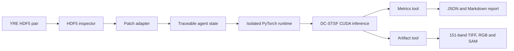
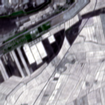
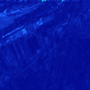

# RSFusionAgent

An executable, traceable agent for remote-sensing spatiotemporal-spectral fusion.

> **V1 scope:** YRE reduced-resolution profile, 151 HS bands, preprocessed HDF5
> inputs and one test patch. Raw-TIFF ingestion and whole-scene stitching are
> deliberately reserved for later versions.

## What V1 does

RSFusionAgent V1 executes a reproducible tool workflow instead of asking a language
model to manipulate image arrays:



Every step is recorded in `run_manifest.json`. Large arrays are exchanged through
artifact paths rather than placed in agent state.

The architecture is inspired by the task-aware tool orchestration ideas in
[RS-Agent](https://github.com/IntelliSensing/RS-Agent), while this repository
implements an executable workflow for the author's YRE fusion model.

## Verified YRE demo

The V1 workflow was verified end to end on patch index 0 using the epoch-200
checkpoint. The private HDF5 data and checkpoint are not included in this repository.

| Fused RGB preview | Per-pixel SAM heatmap |
|---|---|
|  |  |

| PSNR (dB) | RMSE | SAM (degree) | ERGAS | SSIM | CC |
|---:|---:|---:|---:|---:|---:|
| 32.0344 | 0.02502 | 2.0984 | 1.8523 | 0.96577 | 0.97729 |

The two independent CUDA runs produced identical Agent outputs. Compared with the
historical TIFF exported by the legacy test script, the maximum absolute pixel
difference was `1.85e-4`, while all six reported metrics agreed at the displayed
precision.

## Frozen YRE-151 data contract

V1 reads the `test` dataset from two legacy HDF5 files. Each patch uses NHWC layout:

```text
[N, H, W, 306]
channels 0:4       -> MS
channels 4:155     -> interpolated auxiliary HS
channels 155:306   -> HS ground truth
```

The model receives:

```text
auxiliary MS : [1, 4,   H,   W] / 10000
auxiliary HS : [1, 151, H/3, W/3] / 10000
target MS    : [1, 4,   H,   W] / 10000
```

See [docs/data_contract.md](docs/data_contract.md) for the complete contract and
known legacy limitations.

## Current capabilities

- [x] Inspect standalone raster metadata
- [x] Validate a YRE-151 auxiliary/target HDF5 pair
- [x] Load and normalize one reduced-resolution test patch
- [x] Run the DC-STSF checkpoint in an isolated PyTorch environment
- [x] Calculate PSNR, RMSE, SAM, ERGAS, SSIM and CC
- [x] Save a 151-band prediction TIFF, RGB preview and SAM heatmap
- [x] Save machine-readable metrics, tool trace and Markdown report
- [ ] Accept three original TIFF inputs
- [ ] Validate pre-registration and geospatial alignment
- [ ] Perform overlapping whole-scene inference and weighted stitching
- [x] Add optional LLM planning with strict function tools
- [ ] Add solution retrieval and experiment memory
- [ ] Add a Gradio interface

## Project structure

```text
RSFusionAgent/
├── docs/
│   ├── assets/
│   │   ├── yre_rgb_preview.png
│   │   ├── yre_sam_heatmap.png
│   │   └── yre_metrics.json
│   └── data_contract.md
├── src/rsfusion_agent/
│   ├── agent/
│   │   ├── llm_client.py
│   │   ├── llm_state.py
│   │   ├── llm_tools.py
│   │   ├── llm_workflow.py
│   │   ├── state.py
│   │   └── workflow.py
│   ├── models/
│   │   └── dc_stsf.py
│   ├── runtime/
│   │   └── yre151_runner.py
│   ├── tools/
│   │   ├── artifacts.py
│   │   ├── h5_patch.py
│   │   ├── metrics.py
│   │   ├── model_runtime.py
│   │   └── raster_inspector.py
│   └── cli.py
├── examples/
├── tests/
├── outputs/
└── pyproject.toml
```

## Installation

Create the lightweight agent environment:

```powershell
python -m venv .venv
.\.venv\Scripts\Activate.ps1
python -m pip install --upgrade pip
python -m pip install -e ".[dev]"
```

Install the optional natural-language control plane with:

```powershell
python -m pip install -e ".[dev,llm]"
```

The neural network runs in a separate existing Python environment containing a
compatible CUDA-enabled PyTorch installation. This avoids installing a second copy
of PyTorch into the agent environment.

Set the model runtime path for the current terminal session:

```powershell
$env:RSFUSION_MODEL_PYTHON = "C:\path\to\model-env\Scripts\python.exe"
```

Do not commit this machine-specific path. Set it in the terminal session or pass
`--model-python` explicitly. The V1 CLI does not automatically load `.env` files.

Before spending tokens on an agent request, check the model environment locally:

```powershell
rsfusion preflight-runtime `
  --checkpoint $checkpoint `
  --model-python $modelPython `
  --device cuda `
  --pretty
```

This verifies the isolated Python executable, PyTorch import, visible CUDA device and
checkpoint readability. It does not load HDF5 pixels or run a forward pass. A successful
`infer-h5` remains the full end-to-end model smoke test.

## Inspect the HDF5 inputs

```powershell
$auxH5 = "C:\path\to\YRE\DownT1YRE.h5"
$targetH5 = "C:\path\to\YRE\DownT2YRE.h5"

rsfusion inspect-h5 `
  --aux-h5 $auxH5 `
  --target-h5 $targetH5 `
  --patch-index 0 `
  --pretty
```

## Run V1 inference

```powershell
$auxH5 = "C:\path\to\YRE\DownT1YRE.h5"
$targetH5 = "C:\path\to\YRE\DownT2YRE.h5"
$checkpoint = "C:\path\to\checkpoints\model-epochs200.pth"
$modelPython = "C:\path\to\model-env\Scripts\python.exe"

rsfusion infer-h5 `
  --aux-h5 $auxH5 `
  --target-h5 $targetH5 `
  --checkpoint $checkpoint `
  --model-python $modelPython `
  --patch-index 0 `
  --device cuda `
  --output-dir "outputs\yre_patch_0001" `
  --pretty
```

Generated artifacts:

```text
outputs/yre_patch_0001/
├── predicted_hs.tif
├── rgb_preview.png
├── sam_heatmap.png
├── metrics.json
├── report.md
├── run_manifest.json
└── intermediate/
    ├── model_input.npz
    └── model_output.npz
```

V1 intentionally reproduces the legacy TIFF convention: normalized `float32`
values, a synthetic transform and no CRS. This is recorded as a warning in the run
manifest. A future raw-TIFF adapter will preserve target-MS geospatial metadata.

## Run the natural-language agent (optional)

V0.2 implements the standard
[OpenAI Responses API function-calling loop](https://developers.openai.com/api/docs/guides/function-calling).
The LLM can select only three strict-schema tools: inspect the configured HDF5 pair,
run one configured patch, and read the latest result. Local paths cannot be supplied
or changed by the model.

For the Qwen-compatible endpoint that you have already verified, set the generic
provider variables in the current terminal. Do not put a real key in source code,
`.env.example`, CLI arguments or Git history:

```powershell
$env:RSFUSION_LLM_PROVIDER = "qwen"
$env:RSFUSION_LLM_API_KEY = "your-api-key"
$env:RSFUSION_LLM_BASE_URL = "https://<workspace-id>.cn-beijing.maas.aliyuncs.com/compatible-mode/v1"
$env:RSFUSION_LLM_MODEL = "qwen3.7-flash"
```

The CLI also supports `openai`, `deepseek`, and `custom` OpenAI-compatible
providers. `DASHSCOPE_API_KEY`, `DEEPSEEK_API_KEY`, and `OPENAI_API_KEY` remain
available as provider-specific fallbacks. The CLI intentionally does not load `.env`
files automatically; this keeps secrets outside the repository.

Then reuse the local path variables from the inference example:

```powershell
rsfusion agent `
  --request "请先检查数据，再融合第 0 个 patch，并汇报指标和输出文件" `
  --provider qwen `
  --aux-h5 $auxH5 `
  --target-h5 $targetH5 `
  --checkpoint $checkpoint `
  --model-python $modelPython `
  --patch-index 0 `
  --device cuda `
  --output-dir "outputs\llm_yre_patch_0001" `
  --pretty
```

Only the user's text request plus sanitized file names, array shapes, scalar
statistics, metrics and warnings are sent to the API. HDF5 pixels, NumPy arrays and
checkpoint contents stay local. The complete design and safety boundaries are in
[docs/llm_agent.md](docs/llm_agent.md).

Each successful `agent` invocation also saves its full control-plane record to
`<output-dir>/agent_result.json`. It includes tool traces, provider/model metadata,
per-turn and aggregated token usage, and a best-effort cost estimate when the model
has a locally documented price rule. The estimate is for development observation only;
the provider billing console is authoritative.

By default, `agent` runs the same free local preflight before it constructs an LLM
client. The result is saved as `<output-dir>/preflight.json`; if preflight fails, no
model request is made. `--skip-preflight` is reserved for troubleshooting.

## Run the local visual demo

V0.3 provides a local Streamlit interface for configuring one H5 patch, checking the
model environment, running the Qwen agent and viewing the result cards, tool trace,
RGB preview and SAM heatmap. Install the optional UI dependency once:

```powershell
python -m pip install -e ".[dev,llm,ui]"
```

Set the same `RSFUSION_LLM_*` variables used by the CLI, then start the page from the
project root:

```powershell
rsfusion-ui
```

The page opens locally in your browser. It never asks for or stores an API key; the
key remains in the terminal environment. It invokes the existing `rsfusion agent`
workflow, so the runtime preflight, tool allowlist, output isolation and result JSON
records remain active.

V0.4 adds a local run-history selector: reopen an existing `agent_result.json` from
the configured output root without calling the LLM again. The UI and CLI also default
to one extra retry only for the known Windows native fast-fail exit code `0xC0000409`.
Every retry is recorded in the runtime result as `attempt_count` and
`retried_exit_codes`. Set `--runtime-retries 0` to disable it, or at most `2` for
troubleshooting. Path, CUDA, H5 validation and timeout failures are never retried
blindly; the Agent receives a safe error category and recommended action instead.

## Tests

```powershell
python -m pytest -q
python -m ruff check --no-cache src tests examples
```

## Security

- Keep API keys and local runtime paths out of Git.
- Load only trusted PyTorch checkpoints. PyTorch checkpoints can contain serialized data.
- Output and intermediate model artifacts are ignored by Git.
- LLM tools use an allowlist, strict arguments, a configured patch index and a bounded loop.

## License and attribution

This project is planned to use the Apache-2.0 license. The DC-STSF architecture in
`models/dc_stsf.py` is adapted from the author's research project. Upstream license
and copyright notices must be preserved for any future third-party code reuse.
