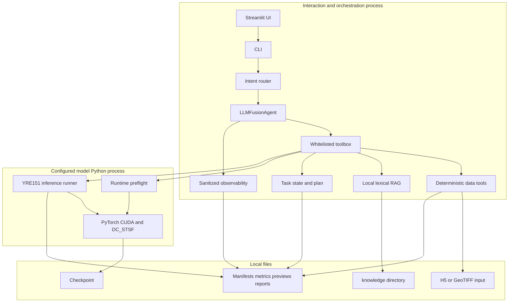
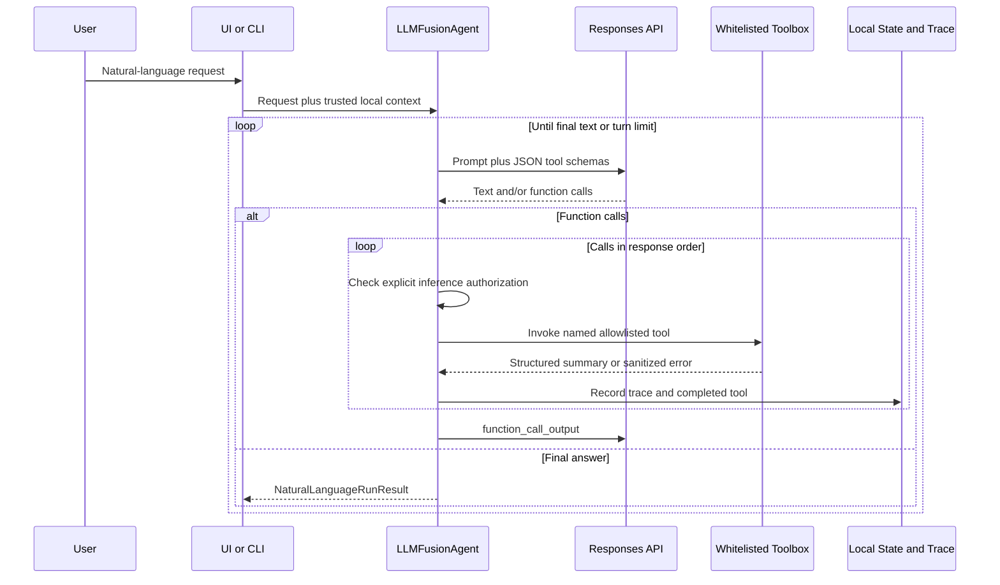
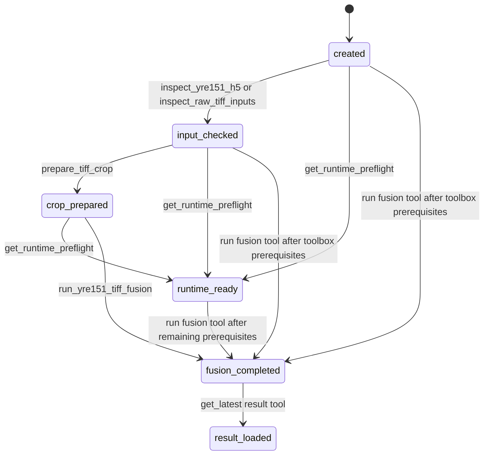
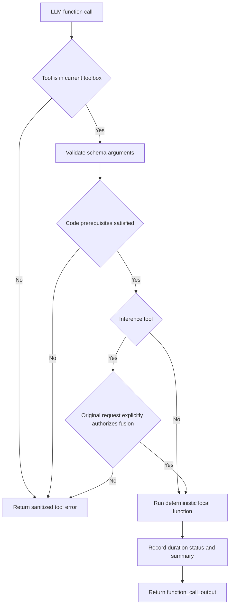
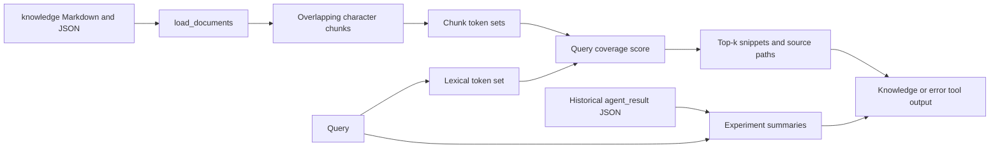
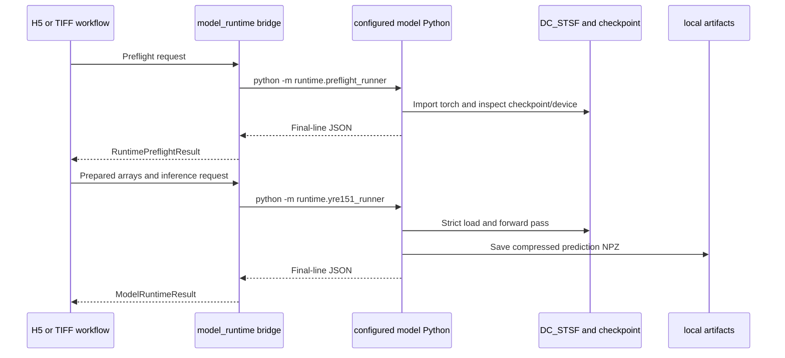

# Architecture

本文件描述当前代码实际运行方式，不描述理想架构或未来路线。系统范围与能力摘要见 `PROJECT_CONTEXT.md`。

## 1. Overall Architecture

RSFusionAgent 采用“交互/编排环境”和“模型运行环境”分离的本地架构：

- Streamlit 或 CLI 接收配置与请求。
- 自定义 Agent 循环调用白名单工具；也可以绕过 LLM，直接运行确定性 CLI 子命令。
- 工具箱持有可信的本地上下文，负责前置条件、路径隔离和推理授权。
- 数据处理在 Agent Python 进程内运行；PyTorch/CUDA 预检与模型推理由另一个已配置 Python 子进程运行。
- 结果以 JSON、GeoTIFF、PNG、Markdown 和轻量状态文件留在本地。

`src/rsfusion_agent/agent/langchain_tools.py` 可以把同一工具箱包装为 LangChain `StructuredTool`，`langchain_agent.py` 提供确定性 façade；它们没有替换 `LLMFusionAgent`，也没有形成 LangGraph 图。

## 2. Agent Loop

核心实现是 `agent/llm_workflow.py::LLMFusionAgent`。系统提示词 `SYSTEM_INSTRUCTIONS` 直接定义在该模块中，仓库没有独立 Prompt 模板目录。

实际循环为：

1. 以用户请求和工具 Schema 调用 `OpenAICompatibleResponsesClient.create_response()`。
2. 客户端使用 Responses API，设置 `store=False`、`parallel_tool_calls=False`，并把供应商响应归一化为文本、工具调用和 Token 用量。
3. 若响应包含工具调用，Agent 按出现顺序逐个调用当前工具箱。
4. 工具返回转换为 `function_call_output` 追加到下一轮输入；工具异常被捕获、脱敏并记录为失败 Trace，不会开放任意回退执行。
5. 融合类工具还要通过基于用户原始请求的显式授权检查，不能只因为 LLM 选择了工具而运行。
6. 获得最终文本时返回 `NaturalLanguageRunResult`；若有工具错误则状态可为 `completed_with_tool_errors`。
7. 超过最大轮数仍未完成时抛出错误。CLI 默认 Agent 最大轮数为有限值；不同入口可以传入不同上限。

### Intent routing

`agent/intent_router.py` 定义 `IntentKind`：

- `knowledge_query`
- `task_status`
- `inspect_inputs`
- `inspect_crop`
- `prepare_crop`
- `run_fusion`
- `clarify`

路由器优先匹配明确中英文规则；未匹配时可通过仅暴露 `decide_user_intent` 的 Schema 约束 LLM 调用分类。若分类调用失败，安全回退为只读 `knowledge_query`，而不是默认运行模型工具。UI 根据意图和输入配置选择查询/H5/TIFF 上下文；直接 CLI 子命令则由命令本身选择上下文。

## 3. State Flow

`agent/task_state.py::TaskState` 只保存：

- `stage`：单一 `TaskStage` 枚举。
- `completed_tools`：成功记录过的状态相关工具名列表。

状态通过临时文件替换方式原子写入 `task_state.json`，不保存影像数组、Checkpoint 或 API Key。`record()` 只接受 `_TRANSITIONS` 中的工具，并保证阶段不回退。

上图反映 `record()` 的单调阶段更新，但不能单独表达所有依赖组合。例如输入检查与模型预检可以独立完成；是否真正可融合由 `completed_tools` 和工具箱前置条件共同判断，而不是只看 `stage`。

`TaskStage.INFERENCE_AUTHORIZED` 已定义用户文案，但当前 `_TRANSITIONS` 没有工具写入它。`agent/task_plan.py::build_task_execution_plan()` 使用 `completed_tools`、输入模式和清单可用性生成以下展示步骤：输入检查、环境预检、TIFF 裁剪（H5 省略）、融合、结果读取。`PlanStepStatus.NOT_REQUIRED` 已定义，但当前构建器仅产生 completed/ready/blocked。

## 4. Tool Calling Flow

### Tool contexts and allowlists

| Context | Toolbox | Purpose |
| --- | --- | --- |
| 只读问答 | `QueryToolbox` | 任务状态、知识、错误方案、历史实验 |
| H5 实验 | `AgentToolbox` | H5 检查、预检、H5 融合、结果及只读查询 |
| TIFF 实验 | `TiffAgentToolbox` | 原始输入检查、裁剪、清单检查、TIFF 融合、结果及只读查询 |

工具上下文由 CLI/UI 组装，包含本地路径、输出目录、Patch 参数、模型 Python、设备等可信配置。工具 JSON Schema 不允许模型传入任意路径或命令。

关键前置条件包括：

- H5 融合前需要符合配置的输入检查。
- TIFF 裁剪前需要原始 TIFF 检查。
- TIFF 融合前需要存在并检查过裁剪清单。
- 两种融合均依赖可用的模型预检/运行配置。

可选 LangChain 适配只包装同一调用函数，不能绕过这些工具箱约束。

## 5. RAG Flow

RAG 实现完全离线且无向量数据库：

1. `rag/loader.py::load_documents()` 递归读取知识目录下的 `.md` 和 `.json`，排除路径中的 `evaluations`。
2. `rag/splitter.py::split_documents()` 以默认 900 字符、120 字符重叠切块。
3. `rag/retriever.py::LocalKnowledgeRetriever` 将英文标识/单词和单个中文字符转为集合。
4. 评分为查询 Token 中被块 Token 覆盖的比例；按分数排序返回 top-k 来源和片段。
5. `error_retriever.py` 将范围限制在 `knowledge/errors/`。
6. `experiment_memory.py` 从历史运行目录递归读取 `agent_result.json`，构建轻量摘要并做简单文本匹配。
7. `evaluation.py` 比较 top-k 来源和评测用例的期望来源，处理 Windows/POSIX 分隔符差异并输出命中率报告。

`knowledge/evaluations/rag_eval.json` 不进入生产检索语料，只用于回归评测。当前评测不能证明最终自然语言答案正确。

### Agent task evaluation

V2.2 的 `agent/evaluation.py` 在不调用网络、GPU、Checkpoint 或真实遥感数据的前提下，
复用生产 `LLMFusionAgent` 执行确定性回放。每个 `AgentEvaluationCase` 描述用户请求、
预期意图、脚本化模型 turns、允许/必需工具、禁止实际执行的工具、期望调用顺序和安全断言。

回放使用 `ReplayResponsesClient` 和受控内存工具箱；工具箱只返回合成摘要或预设错误，
不会打开本地路径。评测器比较意图、工具选择、参数、顺序、任务状态、错误恢复和安全门，
输出 `AgentEvaluationReport` 的 JSON 及 Markdown 摘要。未授权推理的指标统计实际执行次数，
因此“模型尝试调用但被安全门拦截”不会被误计为推理成功。

评测集位于 `knowledge/evaluations/agent_eval.json`，通过 `evaluate-agent` CLI 执行。该评测
证明的是 Agent 控制面的可回归行为，不代表真实 LLM 的回答质量、供应商服务可用性或模型端到端结果。

## 6. Model Inference Flow

### Process boundary

`tools/model_runtime.py` 是 Agent 环境和模型环境的唯一显式桥接层：

- 构造参数数组调用配置的 Python，可避免 Shell 字符串拼接。
- 将仓库 `src` 注入子进程 `PYTHONPATH`。
- 通过超时限制等待子进程。
- 读取子进程最后一行 JSON，验证为 `RuntimePreflightResult` 或 `ModelRuntimeResult`。
- 原生崩溃仅对已识别的 Windows 退出码执行有限重试。

`runtime/preflight_runner.py` 导入 PyTorch、解析设备、检查 CUDA/GPU 信息并在 CPU 上读取可信 Checkpoint。`runtime/yre151_runner.py` 加载 DC_STSF、严格加载权重、校验 4/151 波段及空间尺寸关系、执行推理并保存压缩 NPZ。

### H5 workflow

`agent/workflow.py::YRE151PatchAgent` 使用 `tools/h5_patch.py` 读取 `test` 数据集。当前契约是 NHWC `[N,H,W,306]`：4 通道 MS、151 通道插值 HS、151 通道参考 HS，按 10000 缩放，空间尺度关系为 3。工作流检查输入、准备数组、调用运行时、计算全参考指标并写出预测、预览、热力图、指标、清单和报告。

### TIFF workflow

`agent/tiff_workflow.py::YRE151TiffPatchAgent` 消费明确的裁剪清单：

- 模拟实验要求目标时相 HS；它作为原生低分辨率真值参与输入构造和全参考评估。
- 真实实验的目标时相 HS 可选；提供时只能作为伪参考标签，不能表述为严格真值。
- 输出预测保留地理参考，并生成 RGB、SAM 热力图（有参考时）、指标和运行报告。

裁剪与 Patch 逻辑只选择非重叠窗口，不负责整景拼接。

## 7. Error Handling

错误处理分为四层：

1. **数据/配置层**：Pydantic、文件存在性、尺寸、波段和地理元数据检查在执行前失败。
2. **工具箱层**：缺少输入检查、裁剪清单、运行时预检或显式推理授权时返回可恢复错误。
3. **模型子进程层**：非零退出、超时、JSON 协议错误和已知原生退出码由 `model_runtime.py` 转换为 Python 异常；重试次数有限。
4. **解释层**：`tools/error_diagnosis.py` 把错误归为配置、数据、CUDA、原生库、超时、LLM 或未知类别；`task_plan.py` 为常见清单、目标 HS 和 Patch 范围问题提供具体恢复动作。

Agent 工具错误写入 `LLMToolTrace`，并允许模型在剩余轮次中解释或恢复。CLI 顶层使用参数解析器报告失败。UI 通过结果文件修改时间防止复用旧 `agent_result.json`，并把 CLI 输出作为本轮失败证据。

`observability.py` 只保留工具名、状态、耗时、参数字段名、脱敏错误、Token/成本摘要、状态和制品文件名；路径值会缩减为文件名。

## 8. Data Flow

### Local input to output

| Stage | Input | Output |
| --- | --- | --- |
| Inspect | H5 或 3/4 个 TIFF 路径 | 结构化元数据、警告/阻塞项、RGB 预览 |
| Crop (TIFF) | 已检查 TIFF + 预设窗口 | Patch TIFF、`crop_manifest.json` |
| Preflight | 模型 Python、Checkpoint、device | 运行时/设备/Checkpoint 摘要 |
| Inference | H5 Patch 或清单选定 TIFF Patch | 本地预测 NPZ/GeoTIFF 与运行时间 |
| Evaluation | 预测 + 可用参考 | 指标 JSON、RGB、SAM 图等 |
| Agent result | 工具结构化摘要 | `agent_result.json` 和自然语言回答 |
| Observability | Trace、状态、计划、制品路径 | `execution_trace.json`、`agent_execution_report.md` |

LLM 可见的是请求文本、工具 Schema 和工具生成的摘要；原始数组和 Checkpoint 不进入 LLM 请求。

### Configuration flow

- API Key 仅从进程环境读取，典型变量为 `RSFUSION_LLM_API_KEY`、`DASHSCOPE_API_KEY` 或 `OPENAI_API_KEY`。
- Provider、模型 ID、兼容 Base URL、模型 Python、device 和本地路径由 CLI 参数或 Streamlit 配置形成上下文。
- UI 只把非秘密偏好写入被 Git 忽略的 `outputs/ui_preferences.json`；API Key 不写入该文件。
- `.env.example` 是示例，不代表 CLI 自动加载 `.env`。

## 9. External Dependencies

### Required Python packages

基础依赖在 `pyproject.toml`：h5py、NumPy、OpenCV headless、Pillow、Pydantic、Rasterio、scikit-image。

### Optional packages

- `openai`：LLM/Responses API。
- `langchain-core`：工具包装适配。
- `streamlit`：Web UI。
- `pytest`、`ruff`：开发验证。

### Separately managed model environment

PyTorch/CUDA 不在基础或 UI extra 中声明。模型 Python 必须由使用者配置，并具备与 Checkpoint/硬件兼容的 PyTorch、CUDA 及本项目可导入环境。

### External services

只有自然语言 LLM 请求需要外部 OpenAI-compatible API。数据工具、模型推理、本地 RAG、RAG 评测及结果生成均设计为本地执行。供应商额度、模型 ID 与 Base URL 是部署配置，不属于仓库可保证的稳定资源。
