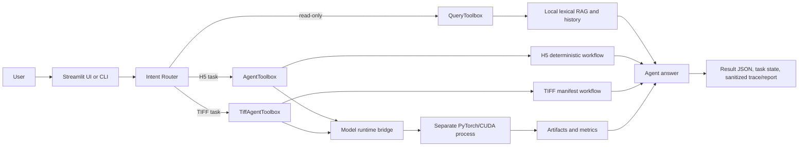

# Project Context

本文件回答“RSFusionAgent 当前到底是什么”。它描述当前 Git 工作区中的实际系统边界，不作为开发规范、详细架构说明或路线图。开发规范见 `../AGENTS.md`，详细流程见 `ARCHITECTURE.md`，完成度见 `DEVELOPMENT_STATUS.md`。

## Project Goal

RSFusionAgent 的目标是把遥感时空谱融合中的输入检查、实验裁剪、模型环境验证、单 Patch 推理、质量评估、结果可视化和故障解释组织为一个可追踪、受约束的本地 Agent 工作流。

当前正式版本标识为：Python 包版本 `1.1.1`，项目开发版本 V2.1。两者分别表达包发布版本和项目功能阶段，并非互相冲突。

系统强调三个边界：

- 遥感数据、模型权重和 GPU 推理留在本机。
- LLM 只负责理解请求和选择白名单工具，不能直接访问任意文件、Shell 或模型进程。
- 真实执行由确定性的 Python 工具完成，并留下结构化结果、运行清单和脱敏 Trace。

## Current System

当前代码实际提供以下能力：

1. **栅格与输入检查**：读取 GeoTIFF/H5 元数据、数值范围和通道布局，生成 RGB 预览，并区分阻塞问题与外部配准模式下的警告。
2. **两条实验路径**：
   - H5：读取 YRE151 格式的成对 Patch，执行单 Patch 模型推理和全参考指标计算。
   - GeoTIFF：检查辅助 MS/HS 与目标 MS，生成并检查 `crop_manifest.json`，再执行真实实验或模拟实验的单 Patch 融合。
3. **本地模型运行时**：由配置的独立 Python 子进程执行 PyTorch/CUDA 预检和 DC_STSF 推理，使 UI/Agent 环境不必安装 PyTorch。
4. **自然语言 Agent**：使用 OpenAI-compatible Responses API 进行意图识别与顺序 Function Calling；工具集合、最大轮次、推理授权和前置依赖受到代码约束。
5. **任务状态与计划**：将阶段和已完成工具写入本地 `task_state.json`，并据此生成执行计划与恢复建议。
6. **本地 RAG**：对 `knowledge/` 中的 Markdown/JSON 做离线词法检索；支持通用知识、错误方案和历史实验摘要检索。
7. **RAG 评测**：使用版本化问题/期望来源集合计算 top-k 来源命中率并输出 JSON 报告。
8. **可观测性**：输出脱敏的 `execution_trace.json` 和 `agent_execution_report.md`，记录工具状态、耗时、Token/成本估算、任务状态和制品文件名。
9. **Streamlit UI 与 CLI**：提供本地配置、自然语言交互、快捷操作、结果展示和历史运行读取；所有核心能力也可通过 CLI 调用。
10. **错误诊断**：对配置、数据、CUDA、原生库、超时、LLM 和未知错误进行分类并给出恢复建议。

当前系统不包含 FastAPI 服务、LangGraph 状态图、向量数据库、Embedding 服务、自动遥感配准、全景拼接或模型训练流水线。

## Technology Stack

| Area | Actual implementation |
| --- | --- |
| Language/runtime | Python 3.10+ |
| Data validation | Pydantic v2 |
| Agent | 自定义有界 Function Calling 循环；OpenAI-compatible Responses API |
| LLM client | `openai` Python SDK（可选 extra），支持 OpenAI/Qwen/DeepSeek/Custom 配置 |
| LangChain | 可选 `langchain-core`，仅用于 `StructuredTool` 适配 |
| RAG | 本地 Markdown/JSON 加载、字符切块、词法集合重叠评分 |
| Remote sensing/data | Rasterio、h5py、NumPy、OpenCV、Pillow、scikit-image |
| Model inference | PyTorch/CUDA，在单独配置的模型 Python 环境中运行 |
| Model | 仓库内 DC_STSF 网络结构，面向 4 波段 MS 与 151 波段 HS |
| UI | Streamlit |
| CLI | `argparse` + 包入口 `rsfusion` |
| Testing/lint | pytest、Ruff |
| CI | GitHub Actions，Ubuntu + Python 3.10 |

没有代码证据表明项目实际使用 FastAPI、LangGraph、向量数据库或专用日志服务。

## Core Components

### Agent

`src/rsfusion_agent/agent/llm_workflow.py` 中的 `LLMFusionAgent` 实现顺序、有限轮次的工具调用循环。`src/rsfusion_agent/agent/intent_router.py` 先通过规则识别明确意图，再在必要时调用 LLM 进行 Schema 约束的分类。实际可调用能力由 `llm_tools.py` 中的三类工具箱决定：

- `QueryToolbox`：只读知识、错误、历史和任务状态查询。
- `AgentToolbox`：H5 检查、预检、融合和结果读取。
- `TiffAgentToolbox`：原始 TIFF 检查、裁剪清单、TIFF 融合和结果读取。

### State

`agent/task_state.py` 用 `TaskState` 持久化当前阶段及已完成工具集合。`agent/task_plan.py` 不直接驱动执行，而是根据状态、输入模式和清单可用性生成可显示的依赖计划及恢复动作。

### Tools

`src/rsfusion_agent/tools/` 包含确定性数据和实验工具。工具箱负责把本地可信路径注入工具，并校验检查、裁剪、预检、推理之间的前置条件。LLM 参数中不包含任意本地路径。

### RAG

`src/rsfusion_agent/rag/` 递归读取 `knowledge/` 下的 Markdown/JSON（排除评测目录），切成重叠字符块并按查询 Token 集合覆盖率排序。错误检索限制在 `knowledge/errors/`；实验检索读取历史目录中的 `agent_result.json` 摘要。

### Model Inference

`tools/model_runtime.py` 启动 `runtime/preflight_runner.py` 或 `runtime/yre151_runner.py` 子进程。模型进程导入 PyTorch、加载可信 Checkpoint、校验设备和张量形状，并返回最后一行 JSON 协议。实际网络结构位于 `models/dc_stsf.py`。

### Evaluation

模型结果评估位于 `tools/metrics.py` 与 `tools/artifacts.py`，可输出 PSNR、RMSE、SAM、ERGAS、SSIM、CC 及相关可视化。RAG 评估位于 `rag/evaluation.py`，只衡量预期来源是否进入 top-k，不衡量答案语义正确性。

### UI/API

`ui/streamlit_app.py` 是唯一 Web UI。它通过参数列表调用 `python -m rsfusion_agent.cli`，避免 Shell 拼接；API Key 只从启动进程的环境变量读取。项目当前没有 HTTP API/FastAPI 服务。

## Current Workflow

典型 TIFF Agent 请求按以下实际边界运行：

1. UI/CLI 收集本地配置和自然语言请求。
2. 意图路由确定是知识问答、状态查询、输入检查、裁剪检查/准备还是融合。
3. 若任务需要本地数据，先验证必要配置；知识问答可以只使用只读工具箱。
4. `LLMFusionAgent` 将工具 Schema 发给模型，并按顺序执行获准的工具调用。
5. TIFF 路径先检查原始输入，再创建/检查裁剪清单；模型环境预检可以独立进行。
6. 只有显式融合意图且前置条件满足时，工具箱才调用本地推理工作流。
7. 模型子进程返回预测结果；确定性工作流生成地理参考输出、指标、预览、清单和报告。
8. Agent 汇总自然语言答案；CLI 写入结果、任务状态与脱敏可观测性制品；UI 展示当前结果。

H5 路径无需 TIFF 裁剪清单，但同样通过独立模型运行时执行推理。

## Important Files

| File | Responsibility | Importance |
| --- | --- | --- |
| `src/rsfusion_agent/cli.py` | 所有命令入口、运行上下文组装与结果持久化 | 最高；公开接口和流程汇合点 |
| `src/rsfusion_agent/agent/llm_workflow.py` | Agent 循环、系统提示和显式推理授权 | 最高；自然语言执行核心 |
| `src/rsfusion_agent/agent/llm_tools.py` | 工具 Schema、allowlist、前置条件和路径隔离 | 最高；安全边界 |
| `src/rsfusion_agent/agent/intent_router.py` | 规则/LLM 意图路由 | 高；决定进入哪类流程 |
| `src/rsfusion_agent/agent/task_state.py` | 任务阶段持久化 | 高；本地状态兼容性 |
| `src/rsfusion_agent/agent/task_plan.py` | 执行计划和恢复建议 | 高；UI 与 Trace 解释层 |
| `src/rsfusion_agent/agent/observability.py` | 脱敏执行记录与报告 | 高；调试和可恢复性 |
| `src/rsfusion_agent/agent/workflow.py` | H5 单 Patch 确定性工作流 | 高；H5 结果契约 |
| `src/rsfusion_agent/agent/tiff_workflow.py` | TIFF 清单驱动工作流 | 高；原始影像主路径 |
| `src/rsfusion_agent/tools/model_runtime.py` | 独立模型环境子进程桥接 | 最高；环境隔离边界 |
| `src/rsfusion_agent/runtime/yre151_runner.py` | PyTorch 推理、权重和形状校验 | 最高；真实模型执行 |
| `src/rsfusion_agent/tools/h5_patch.py` | H5 通道布局与归一化 | 高；数据契约 |
| `src/rsfusion_agent/tools/tiff_triplet.py` | TIFF 三元组元数据契约 | 高；空间一致性检查 |
| `src/rsfusion_agent/rag/` | 本地检索和评测 | 中高；知识问答与诊断 |
| `src/rsfusion_agent/ui/streamlit_app.py` | Streamlit 会话、配置、执行和渲染 | 高；当前唯一 Web 入口 |
| `knowledge/` | 受控知识源和 RAG 回归数据 | 高；回答依据 |
| `tests/` | 当前行为的可执行回归证据 | 最高；改动验证基线 |
| `pyproject.toml` | 包版本、依赖、入口和 Ruff 规则 | 高；安装与 CI 基线 |

## Current Limitations

- 只处理选定 Patch；没有全景分块、重叠融合与拼接输出。
- 原始 TIFF 路径不进行自动配准或重投影。`external_registration` 代表用户声明外部已配准，不代表代码验证了残余偏差。
- 当前模型契约固定为 4 波段 MS、151 波段 HS 和特定缩放关系，尚不是通用模型插件系统。
- 私有数据、Checkpoint 和完整模型环境不在 Git 中，克隆仓库后不能独立复现真实 GPU 结果。
- RAG 是词法检索；没有语义 Embedding、向量数据库、重排器或答案正确性评测。
- LLM 成本估算只为代码中列出的少数模型提供本地近似，可能随供应商价格变化而过时。
- Streamlit 聊天记录只存在当前 Session State；服务或浏览器会话重启后不保证持久化。
- CI 只验证 CPU 可运行的代码和测试，不执行私有模型/GPU 端到端推理。

## Known Issues

以下项目均有当前代码/仓库证据，但严重程度和产品取舍仍需后续确认：

1. **README/旧文档漂移**：部分段落仍把 TIFF 适配、错误检索或实验历史检索描述为未来工作，但相关实现已存在；`docs/llm_agent.md` 的工具表也少于当前工具箱。
2. **四份本地文档不属于发布内容**：当前工作区的 `docs/v1_development_summary.md`、`docs/v2_development_summary.md`、`docs/v2_1_development_plan.md`、`docs/v2_five_day_plan.md` 是作者个人开发计划/总结，按作者决定只保存在本地，不应提交或上传到公开仓库。
3. **许可证边界尚未落地**：`pyproject.toml` 声明 Apache-2.0，README 使用“planned”表述，且根目录没有已跟踪的 `LICENSE`。作者已确认 DC_STSF 是个人算法模型且尚未开源，因此应用代码与模型代码不能在没有明确许可拆分的情况下笼统使用同一开源声明。
4. **保留但未进入当前流程的枚举值**：`TaskStage.INFERENCE_AUTHORIZED` 与 `PlanStepStatus.NOT_REQUIRED` 在当前定义中存在，但现有转换/计划构建没有实际产生这些值。
5. **任务状态是线性摘要**：输入检查、预检等可以独立完成，但 `stage` 使用单一有序枚举；实际依赖判断依赖 `completed_tools`，仅阅读 `stage` 可能丢失并行维度。
6. **工具 Schema 多处维护**：工具 JSON Schema、工具箱处理和可选 LangChain 包装之间存在人工同步成本。
7. **UI 真实浏览器行为缺少自动化覆盖**：现有 `tests/test_streamlit_ui.py` 主要验证辅助逻辑，近期布局与会话交互不能由该测试完全证明稳定。

“是否应修复、何时修复”属于后续开发决策，见 `DEVELOPMENT_STATUS.md`；本文件不把这些观察自动升级为已排期任务。
