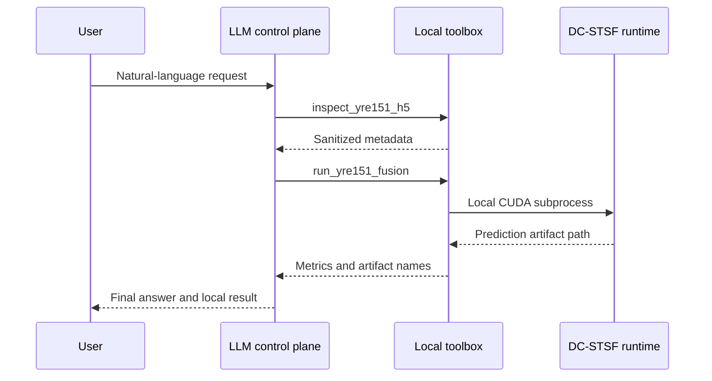

# LLM control plane

RSFusionAgent V0.2 adds an optional natural-language control plane built on the
OpenAI Responses API function-calling loop. The language model chooses from a small
allowlist; NumPy arrays and raster pixels stay inside local deterministic tools.

## Allowlisted tools

| Tool | Purpose | Safety rule |
|---|---|---|
| `inspect_yre151_h5` | Validate the configured HDF5 pair | Must succeed before inference |
| `run_yre151_fusion` | Run one configured patch | Cannot change local paths or patch index |
| `get_latest_fusion_result` | Read the latest metrics and artifact names | Requires a completed run |

Every schema uses strict JSON arguments and rejects additional properties. The model
cannot choose arbitrary filesystem paths: paths are supplied by the CLI and held in
local context. Only file names, shapes, scalar statistics, metrics and warnings are
returned to the API. Configured paths are redacted from tool errors. Image arrays,
HDF5 content and checkpoints are never uploaded.

## Loop

The loop is bounded by `--max-turns` and records tool call IDs, validated arguments,
status, elapsed time and sanitized output. Tool failures are returned to the model so
it can explain or safely recover.

## Security notes

- Set `OPENAI_API_KEY` in the environment; never put it in CLI arguments or Git.
- Only load trusted PyTorch checkpoints.
- Treat the natural-language layer as a control plane, not a numerical compute layer.
- Review the configured paths and patch index before starting a paid API request.
